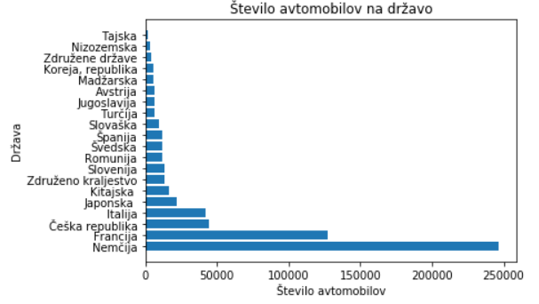

### Fakulteta za računalništvo in informatiko, Univerza v Ljubljani
# Projektna naloga pri predmetu Podatkovno Rudarjenje
Naslov: Prvič registrirana vozila v Sloveniji
 
Avtorja: Domen Rupnik 63180254, Matic Šuc 63180290
 
Mentor: doc. dr. Tomaž Curk
 
## Uvod
V nadaljevanju je predstavljena dosedanje delo pri projektni nalogi pri predmetu Podatko Rudarjenje, z naslovom Prvič registrirana vozila v Sloveniji.

## Podatki
Podatki so pridobljeni iz spletne strani [podatki.gov.si](https://podatki.gov.si/dataset/prvic-registrirana-vozila-po-mesecih), kjer so za vsak mesec zbrani podatki o registraciji vozil v Sloveniji, v csv datotekah, poimenovanih 'Podatki_mesecleto'. V projektni nalogi, bova uporabljala 60 takih datotek, torej podatke za obdobje od leta 2015 do leta 2019. Vsaka vrstica je opisana s 101 atributom. Atributi vecinoma opisujejo lastnosti in identifikacijo vozila, podtke o lokaciji registracije in nekaj osnovnih podatkov o lastniku vozila oz osebi, ki ga je registrirala.

Pri delu s podatki je bilo odkritih nekaj napak, na katere sva bila v nadaljevanju bolj pozorna.

## Izvedene analize
### Prikaz najpogostejše barve glede na čas
Eden izmed najinih ciljev pri projektni nalogi je bil, da bi ugotovila, katera je bila najpogostejša barva pri na novo registriranih avtomobilih v Sloveniji. Kmalu sva ugotovila, da je bila za vsak mesec med leti 2015 in 2019, najpogostejša barva bela. Na drugem in tretjem mestu pa sta se izmenjevali svetlo-siva ter temno-siva. Nad rezultatom sva bila presenečena, saj sva pričakovala, da bi bila najpogostejša barva siva. Na koncu sva se odločila, da bova vizualizirala, kakšen odstotek od vseh barv, predstavlja bela barva. Ker je pa vseh mesecev 60, sva se odločila, da jih združiva po polletjih. Od januarja do junija je prvo polletje in od julija do decembra drugo. Glede na graf sva prišla do spoznanja, da je bele barve povprečno pribljižno malo manj kot 20%.

### Prikaz števila vozil glede na občino

Zanimalo naju je tudi, katera občina ima največ na novo registriranih vozil. Predvidevala sva, da je to občina Ljubljana, saj je občina, ki ima največ prebivalcev. Po prvem delu analize sva ugotovila, da je to res občina Ljubljana. Med letoma 2015 in 2019 je imela na novo registrianih kar 154.514. To se nama je zdelo zelo čudno, saj ima občina Ljubljana 288.832 prebivalcev. Kar bi pomenilo, da bi vsak drugi prebivalec občine Ljubljana si v tem času kupil novo vozilo. Šla sva pregledovat podatke in ugotovila, da med podatki niso samo na novo registirana vozila, ampak tudi vozila, ki se jih je v tem času odjavilo. Zato sva popravila kodo in novo število na novo registriranih vozil v Ljubljani je bilo 132.185. Še vedno je bila zelo velika številka. Narisala sva graf za 10 občin z največ vozili.

Odločila sva se, da pogledava, koliko izmed vseh registrianih je registriranih na podjetje. Prišla sva do ključne ugotovitve, ki je ta, da je 86% vozil registriranih na podjetje. Kar pomeni, da je fizičnih kupcev v Ljubljani 17.267. Spet sva vizualizirala 10 občin z največ vozili.

### Prikaz števila vozil glede na državo porekla

Analizirala sva tudi število vozil glede na državo porekla. Ugotovila sva, da je Slovenija kot država porekla vozila  na osmem mestu. Prva je kot pričakovano Nemčija. Vseh različnih držav je 70. Med vsemi je vozili ima Slovenija 1.98% delež, Nemčija pa 36.64%. Vizualizirala sva graf števila vozil na državo.

