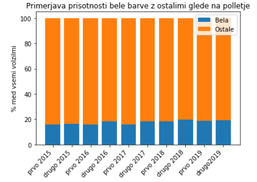
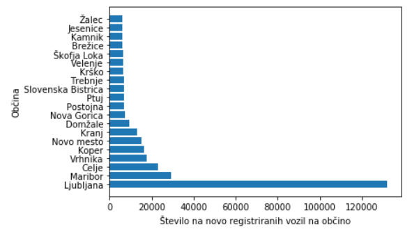
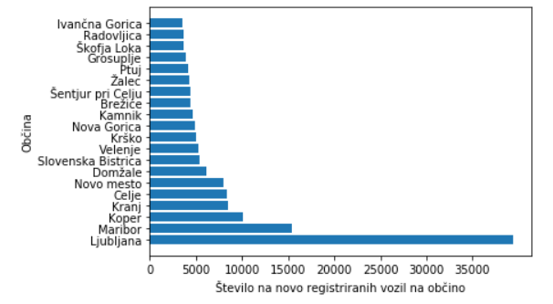
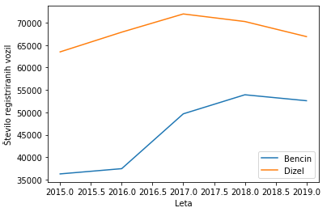
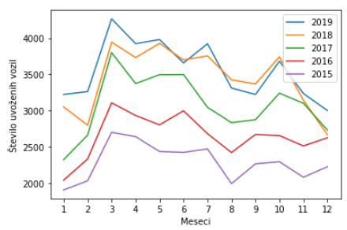
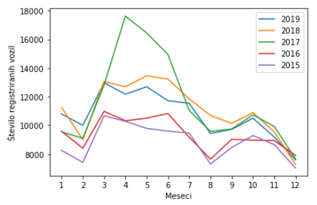
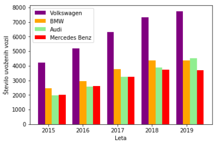
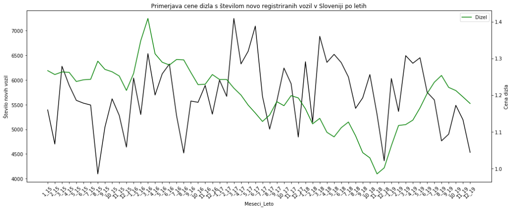
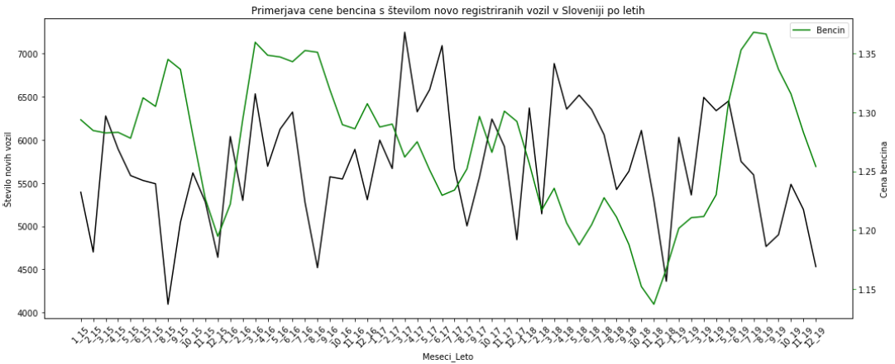

### Fakulteta za računalništvo in informatiko, Univerza v Ljubljani
# Projektna naloga pri predmetu Podatkovno Rudarjenje
Naslov: Prvič registrirana vozila v Sloveniji
 
Avtorja: Domen Rupnik 63180254, Matic Šuc 63180290
 
Mentor: doc. dr. Tomaž Curk
 
## Uvod
V nadaljevanju je predstavljena dosedanje delo pri projektni nalogi pri predmetu Podatko Rudarjenje, z naslovom Prvič registrirana vozila v Sloveniji.

## Podatki
Podatki so pridobljeni iz spletne strani [podatki.gov.si](https://podatki.gov.si/dataset/prvic-registrirana-vozila-po-mesecih), kjer so za vsak mesec zbrani podatki o registraciji vozil v Sloveniji, v csv datotekah, poimenovanih 'Podatki_mesecleto'. V projektni nalogi, bova uporabljala 60 takih datotek, torej podatke za obdobje od leta 2015 do leta 2019. Vsaka vrstica je opisana s 101 atributom. Atributi vecinoma opisujejo lastnosti in identifikacijo vozila, podtke o lokaciji registracije in nekaj osnovnih podatkov o lastniku vozila oz osebi, ki ga je registrirala.

Med izdelavo projekta sva uporabila še dodatne podatke o cenah goriv skozi leta. Podatki so bili pridobljeni iz spletne strani [podatki.gov.si](https://www.gov.si/teme/cene-naftnih-derivatov/), kjer sta za dizel in bencin datoteki tipa doc, v katerih so tabele cen goriv, ki se spreminjajo vsaj vsakih 14 dni.

Pri delu s podatki je bilo odkritih nekaj napak, na katere sva bila v nadaljevanju bolj pozorna.

## Problem
Problem oziroma cilj te projektne naloge je bil, najti oziroma pridobiti zanimive ugotovite iz večjih podatkov. Na začetku, sva si zastavila nekaj osnovnih ciljev, ki sva jih v nadaljevanju vizualizirala, nato pa med delom odkrila nove zanimivosti in raziskovala v njihovi smeri.

## Izvedene analize

### Največja hitrost

Za začetek naju je zanimalo katera vozila imajo največjo hitrost. Pri tej nalogi sva najprej dobila nerealne rezultate in ugotovila, da je v podatkih veliko napak. Primer napake v podatkih je, da je najhitrejše vozilo (vozilo z najvišjo maksimalno hitrostjo) prikolica za tovorna vozila, ki dosega hitrosti do 910 km/h. To sva popravila tako, da sva hitrost vozil v podatkih filtrirala do meje 370 km/h, ki se je izkazala za optimalno in tako dobila realnejše oziroma pravilne podatke. Najhitrejše novo registrirano vozilo je  Porsche 911 GT2 RS, ki ima najvišjo možno hitrost 340 km/h. Ampak ker je to vozilo na bencinsko gorivo, sva pogledala še najhitrejše vozilo z dizelskim gorivom. Pričakovala sva, da bo hitrost malce nižja. Bila sva presenečena, saj je najhitrejši dizelski avtomobil Porsche Panamera 4s Diezel, ki dosega le 280 km/h. To je 60 km/h manj kot najhitrejši bencinar. Z znanjem te analize, sva nadaljevala projektno nalogo in bila pozorna na napake v podatkih v nadaljevanju.

### Moč vozil

Ker sva raziskala hitrosti vozil, sva se odločila, da pogledava še kar se tiče moči vozil (kW).  Najmočnejše vozilo naj bi bil traktor, FIAT Štore 504. Ampak ker je to napaka pri vnosu podatkov, sva rezultate filtrirala in ugotovila, da je najmočnejše novo registrirano vozilo vlečno vozilo VOLVO FH16, ki ima 552 kW. Največjo moč sva pogledala za vsako vrsto vozila posebej. Na primer najmočnejši osebni avtomobil je DODGE Charger Str Hellcat s 527 kW. Najmočnejši motor pa MV AGUSTA F4 RR ABS, s 148 kW.

### Vizualizacija najpogostejše barve glede na čas
Eden izmed najinih ciljev pri projektni nalogi je bil, da bi ugotovila, katera je bila najpogostejša barva pri na novo registriranih avtomobilih v Sloveniji. Kmalu sva ugotovila, da je bila za vsak mesec med leti 2015 in 2019, najpogostejša barva bela. Na drugem in tretjem mestu pa sta se izmenjevali svetlo-siva ter temno-siva. Nad rezultatom sva bila presenečena, saj sva pričakovala, da bi bila najpogostejša barva siva. Na koncu sva se odločila, da bova vizualizirala, kakšen odstotek od vseh barv, predstavlja bela barva. Ker je pa vseh mesecev 60, sva se odločila, da jih združiva po polletjih. Od januarja do junija je prvo polletje in od julija do decembra drugo. Glede na graf sva prišla do spoznanja, da je bele barve povprečno pribljižno malo manj kot 20%.

### Vizualizacija števila vozil glede na občino

Zanimalo naju je tudi, katera občina ima največ na novo registriranih vozil. Predvidevala sva, da je to občina Ljubljana, saj je občina, ki ima največ prebivalcev. Po prvem delu analize sva ugotovila, da je to res občina Ljubljana. Med letoma 2015 in 2019 je imela na novo registrianih kar 154.514. To se nama je zdelo zelo čudno, saj ima občina Ljubljana 288.832 prebivalcev. Kar bi pomenilo, da bi vsak drugi prebivalec občine Ljubljana si v tem času kupil novo vozilo. Šla sva pregledovat podatke in ugotovila, da med podatki niso samo na novo registirana vozila, ampak tudi vozila, ki se jih je v tem času odjavilo. Zato sva popravila kodo in novo število na novo registriranih vozil v Ljubljani je bilo 132.185. Še vedno je bila zelo velika številka. Narisala sva graf za 10 občin z največ vozili.

Odločila sva se, da pogledava, koliko izmed vseh registrianih je registriranih na podjetje. Prišla sva do ključne ugotovitve, ki je ta, da je 86% vozil registriranih na podjetje. Kar pomeni, da je fizičnih kupcev v Ljubljani 17.267. Spet sva vizualizirala 10 občin z največ vozili.

### Vizualizacija goriv registriranih vozil

Pri tej vizualizaciji sta pričakovano prevladovali dizelsko in bencinsko gorivo, ostalih goriv je bilo nesmiselno dodajati na graf. Obe krivulji upadata, kar je posledica sprememb na tem področju avtomobilizma, saj na trg prihajajo predvsem vozila na električni pogon. Zanimiva je tudi razlika registriranih vozil z bencinskim gorivom, med letoma 2017 in 2016.

### Vizualizacija znamk registriranih vozil

Za to vizualizacijo sva najprej za vsako leto izpisala 3 največ registriranih znamk v tistem letu in ugotovila, da prevladujejo te, ki so vizualizirane na grafu. Presenetljivo je leta 2017, kot 3. najbolj registrirana znamka vozil bila TOMOS, za preostala leta pa je bil razpored enak.

### Vizualizacija starosti registriranih vozil

Pri tej vizualizaciji je bilo potrebno podatek o starosti vozil klasificirati. Prvi razred je novo vozilo, v drugi razred sva klasificirala vozila stara največ 5 let, v tretji pa vsa ostala. Z drugačnim klasificiranjem, bi prišlo do drugačnih rezultatov oz vizualizacij.

### Uvoz vozil

Do zanimivih ugotovitev sva prišla tudi pri temi uvažanja vozil iz tujine. Za registrirano vozilo, ki je bilo uvoženo sva označila vsa tista vozila, pri katerih je bil atribut prva registracija vozila različen od atributa prva registracija vozila v Sloveniji. Najprej sva preštela uvožena vozila za vsak mesec v vsakem letu in ugotovila, da od leta 2015 število uvoženih vozil iz tujine narašča. Poleg tega sva nato našla zanimivo ugotovitev, da so si porazdelitve števil uvoženih vozil iz tujine po letih zelo podobne. Zanimivo je, da je največ uvoženih vozil iz tujine v mesecu marcu, nato pa število počasi upada z manjšo špico v mesecu oktobru. Zakaj je temu tako, se nisva poglobila in obstaja odprto vprašanje. Ugotovitvi sva prikazala tudi s spodnjo vizualizacijo.

Po tej ugotovitvi sva preverila kako je s porazdelitvijo števila vseh registriranih vozil skozi leto, za vsako leto. Graf je precej podoben prejšnjemu o uvoženih vozilih iz tujine, kar prikazuje konsistentnost s prejšnjo ugotovitvijo.

Naslednja ugotovitev na to temo je bila, da je Nemčija država, ki prevladuje pred drugimi država, iz katerih se uvaža vozila v Slovenijo. To je razvidno tudi iz vizualizacije znamk uvoženih vozil iz tujine, v katerih prevladujejo nemške znamke. Na podoben način pa med znamkami uvoženih vozil iz tujine prevladuje znamka Volkswagen, preostale znamke torej Audi, BMW in Mercedes-Benz pa se letno borijo med sabo v številu uvoženih vozil.

### Cene goriv

Zanimiva tema se nama je zdela tudi povezava med spreminjajočami se cenami goriv torej bencin in dizel ter pogonskimi gorivi novo registriranih vozil. Za to nalogo sva projektu dodala podatke o cenah bencina in dizla. Cene goriv sva mesečno zaokrožila. Prav tako sva za vsak mesec od leta 2015 do 2019 preštela novo registrirane avte ter oboje vizualizirala na enem grafu.

Iz grafa lahko razberemo da je cena dizla od leta 2015 pa do 2017 nihala nad 1.2€, nato pa proti koncu leta 2018 padala do 1€. Z registracijo novih dizelskih vozil pa je bilo v teh dveh obdobjih ravno obratno, kar logično nakazuje na to, da so se kupci odločili za nakup vozila z dizelskim pogonom glede na trenutno ceno dizla.

Pri vizualizaciji bencina ter novo registriranih bencinskih vozil, pa to ni tako očitno oziroma samo za nekatera krajša obdobja, kar lahko namiguje na to, da se kupci novih bencinskih vozil niso preveč ozirali na trenutno ceno bencina.

### Obvezna registracija vseh mopedov

S 1. majem 2017 je začel veljati zakon, da je treba registrirati in zavarovati tudi kolesa s pomožnim motorjem, ki lahko peljejo največ 25 kilometrov na uro. Zakon je uvedla novela zakona o motornih vozilih, ki jo je državni zbor sprejel septembra 2016. Zanimalo naju je, kako je to vplivalo na število registracij mopedov. Najprej sva podatke o številu registriranih mopedov grupirala po letih, kar ni bilo tako očitno. Nato sva število registracij mopedov grupirala po meseci ter rezultat vizualizirala.

Največ registracij mopedov so v Sloveniji zabeležili aprila 2017, torej mesec pred začetkov veljave zakona o obvezni registraciji vseh mopedov, nato pa število registracij mopedov do konca leta pade in nekako obdrži obliko pred veljavo zakona z malenkost več registracijami. 

## Zaključek

Pri tem projektu sva se prvič srečala s podatkovnim rudarjenjem. Projekt naju je sprva spominjal na delo s poizvedbami pri podatkovnih bazah, ko sva začela z izpisovanjem osnovnih podatkov. V nadaljevanju pa so stvari postale zanimivejše, ko sva odkrivala zanimivosti v podatkih. Zagotovo je ostalo še veliko zanimivih tem in ugotovitev v tej podatkovni zbirki.
